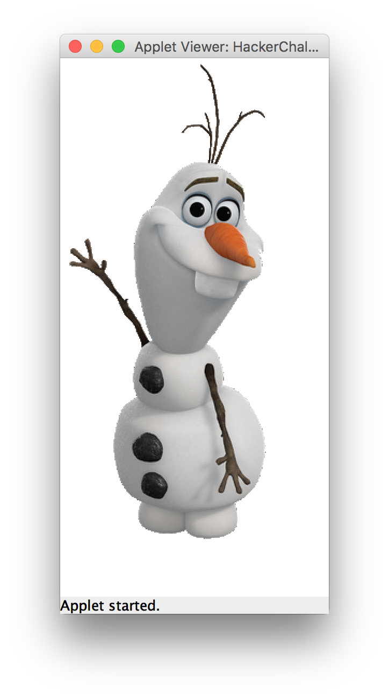

# CS170_IC04_HackerChallenge_Olaf

Hacker Challenge! (optional)
Java Project Name: IC04_HackerChallenge_Olaf

Write an applet program to draw your best rendition of "Olaf" the snowman from the movie frozen.  Attached to this assignment is a PDF document showing a step-by-step guide.  This is a complicated cartoon character, so try your best to recreate the drawing, but feel free to improvise when needed.  It does not have to be 100% accurate for extra credit.  Here is an image of "Olaf" from Wikipedia:

